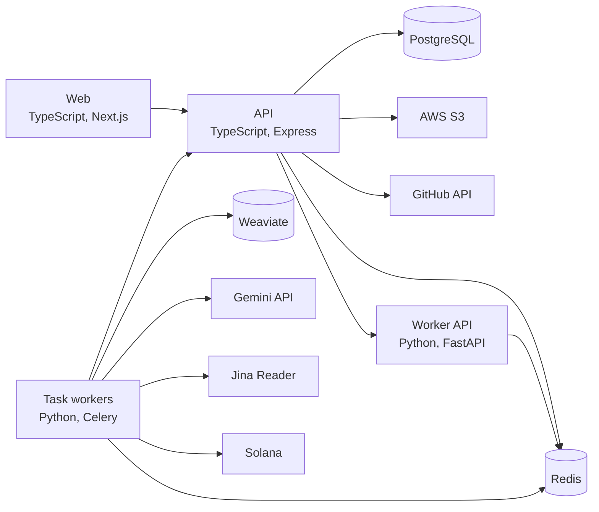

# Commitly

Commitly turns a developer's GitHub commit history into job-specific pages that show recruiters which real contributions match a given job posting. It embeds and scores commits with Gemini, stores them in Weaviate, matches them against the scraped job posting, and won Best Use of AWS at Hook 'Em Hacks 2026.

